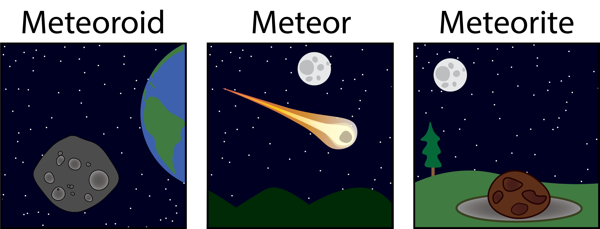
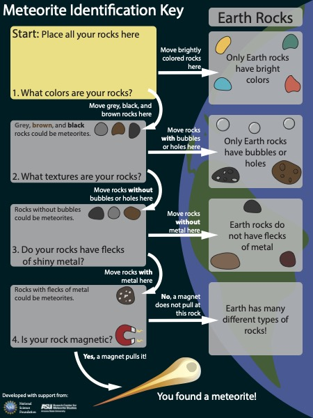
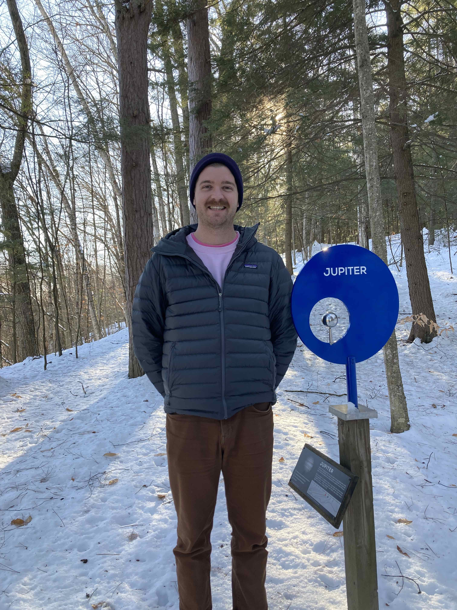

As part of my postdoctoral work, I am developing programming focused on meteorites, asteroids, and the solar system...

<figure>

<figcaption> Diagram illustrating the difference between a <b>Meteoroid</b> (a small body in the solar system that could collide with Earth), a <b>Meteor</b> (a small extraterrestrial body falling through Earth's atmosphere), and a <b>Meteorite</b> (a small extraterrestrial body that has landed on Earth). [<i>Please feel welcome and encouraged to use this original image for your own outreach efforts!</i>]
</figure>

---
I recently developed a new meteorite identification key for their "Meteorites!" activity:

 

---
 

I am piloting a new program called "<i>A Journey to Jupiter</i>" — a 15-30 minute walk along the Montshire Museum's Planet Trail, where we walk from the Sun to Jupiter, using meteorites to help understand the history of our star and its rocky planets.

 

---
 

And I have more new activities in the works!