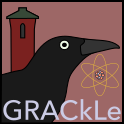

Learn more about my active research program as the Primary Investigator (PI) of the <em>Geochemistry & Radioisotope Analysis & Computation Laboratory</em> ([GRACkLe](https://grackletu.github.io)):

# Past Research Efforts

I actively maintain active and ongoing research on the [GRACkLe](https://grackletu.github.io) website. The pages below reflect past statuses of ongoing research projects or dormant research projects, archived here for posterity.




  

