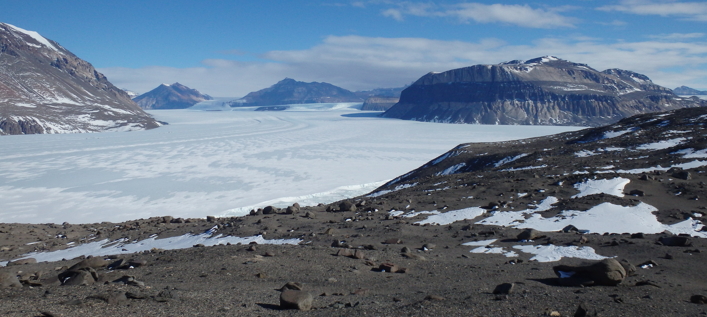
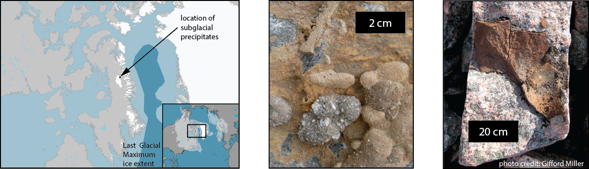
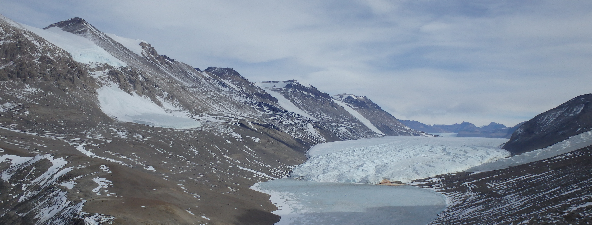

I use a variety of geochemical tools, including U-series isotopes, to reconstruct time and process in subglacial systems.
 

---
### Subglacial Waters

While we often think of glaciers and ice sheets in terms of their frozen water (ice), expansive and dynamic reservoirs of liquid water can exist beneath the ice. I am curious about how subglacial waters evolve and interact with the overlying ice. To reconstruct the characteristics and timescales of these subglacial waters, I study mineral precipitate rocks that formed out of these subglacial waters.

The Laurentide Ice Sheet used to cover much of North America, reaching its greatest size and extent during the last glacial maximum about 20,000 years ago. Today, all that remains of the ice sheet is the Barnes Ice Cap of Baffin Island. Carbonate rocks preserved at the edge of the ice cap formed out of waters that flowed there beneath &gt;1000 meters of ice during the last glacial maximum.

 

 

Using U-Th geochronology, we found that these rocks all formed during episodes of rapid iceberg discharge, called Heinrich events. Our results help constrain the long-debated stimulus of these Heinrich Events. By measuring several different isotopic systems, we reconstructed the origins of the parent waters of these rocks, showing that they formed from distantly sourced waters that traveled through a long, interconnected network of water beneath the ice sheet. [Check out our new publication on this work!](https://www.science.org/doi/10.1126/sciadv.abp9329)

---
### Subglacial Rocks
Glaciers wear away at the very land they sit on as the ice flows and slides over it. At the base of glaciers, pieces of rock are entrained in the ice and dragged along the ground, or “bed,” gouging and chipping the bedrock as the ice moves. Processes like this grind, wear, and otherwise break down, or __*comminute*__, the bedrock and subglacial sediment. In these fine particles, the recoil experienced by U-series nuclides during radioactive decay can result in ejection of daughter nuclides from particles. For an overview of U-series geochemistry and a summary of comminution dating,  [read this](https://grahamedwards.github.io/research/u-comm).

U-series comminution dating, while a challenging technique fraught with complications, offers a unique chronometric tool for understanding the timescales of erosive processes. I have been using U-series comminution techniques to constrain the timing of sediment comminution in Taylor Valley, Antarctica (image). Taylor Valley silts exhibit complex U-series systematics reflecting a variety of weathering histories, and more dynamic glacial erosion by Taylor Glacier than previously thought! A manuscript on the results of this study is currently under review. I kept a [blog of our 2017 fieldwork](https://edwardsgh.wordpress.com/blogs/taylor-valley-antarctica-2017/).

