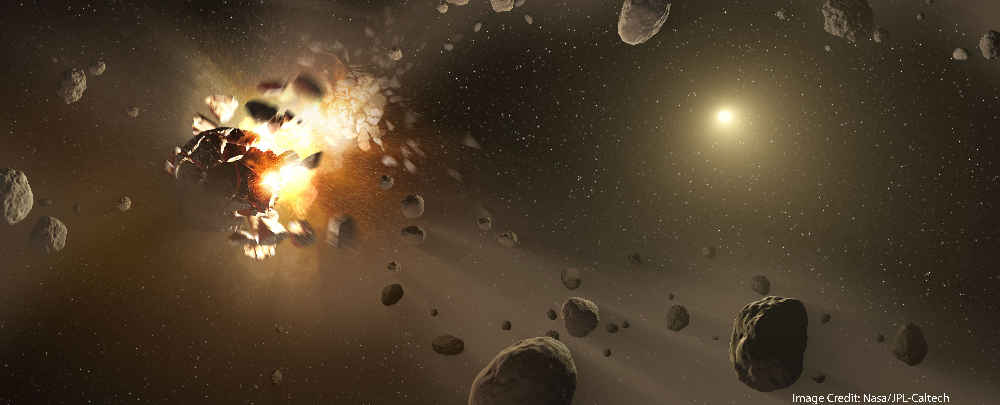

## Statistical cosmochemistry
Meteorites, fragments of the solar system’s first generations of planetesimals and relics of our solar system’s protoplanetary disk, provide the only samples of any stellar system available to study with laboratory methods. 
While extrasolar protoplanetary and debris disks may be observed remotely, meteorites alone afford the opportunity to study diverse disk materials with high analytical precision.

As a National Science Foundation Astronomy &amp; Astrophysics Postdoctoral Fellow, I developed statistical and computational methods to interrogate extant meteorite chemical data. I examined the thermochronologic histories of chondrites with Bayesian statistical models to constrain the timescales and mechanisms of giant planet migration in the young solar system ([ArXiv](https://arxiv.org/abs/2309.10906), [AstroBites](https://astrobites.org/2023/09/25/meteorites-planet-migration/)). It's an exciting time in the field as planetary scientists are actively testing many different models of this process, and I have gotten the opportunity to weigh in on the conversation in articles in [Science Magazine](https://www.science.org/content/article/giant-planets-ran-amok-soon-after-solar-system-s-birth) and [Sky & Telescope](https://skyandtelescope.org/astronomy-news/meteorites-tighten-timeline-for-giant-planets-movement-through-the-solar-system/).

In my ongoing work, I am developing improved chemical models of planetesimals from the inner and outer regions of the solar system.

## Cosmochronology and early solar system history

Shortly after the formation of the Sun, the first small planetary bodies, called planetesimals, formed within the collapsing primordial dust cloud and became the building blocks of the planets and asteroids in our solar system today. Some of these bodies reached sizes exceeding 100 km (~60 miles) across, not nearly as large as the planets of the solar system today (Earth is ~13,000 km across), but large enough that they were held together by their own gravity and could survive collisions with much smaller objects. 

These planetesimals were too small to be heated by the energy released by accretion (like the Earth was), but were large enough that heat produced inside the bodies by the decay of radioactive isotopes (e.g. 26Al, 238U, 235U, 232Th, 40K) was retained in the bodies for tens of millions of years or more. The short-lived radionuclide 26Al was the most important heat-producing isotope in the first few million years of the solar system and its radiogenic heat drove melting in the earliest forming bodies that incorporated the most 26Al. Later-forming asteroids accreted from a reservoir with less available 26Al (since it had decayed away), so these did not melt but still got quite hot. The chondrites come from this latter group, while achondrites and irons derive from the earlier-forming melted and differentiated bodies. 

[My prior work](https://grahamedwards.github.io/publication/2020-LLchondrite) has focused on the U-Pb phosphate cooling histories of the LL chondrites, which require parent asteroid accretion overlapping in time with chondrule formation and a planetesimal size far larger than is usually assumed for ordinary chondrites. Ongoing research looks at the U-Pb cooling histories of highly metamorphosed and nearly melted type 7 ordinary chondrites to understand how thermal extremes and the onset of metal-silicate differentiation were attained in the chondrite planetesimals. 